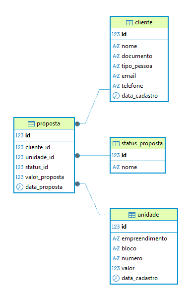

# 🏢 `<A2D-Dev />`

## Sistema de Propostas Imobiliárias

Projeto desenvolvido como parte da transição para a área de desenvolvimento, com foco na aplicação de conceitos de banco de dados em cenários reais do mercado imobiliário.

---

## 📌 Sobre o projeto

Este projeto simula um fluxo real de gestão de propostas imobiliárias, permitindo o cadastro e acompanhamento de propostas de forma simples e organizada.

Foco em prática de desenvolvimento, modelagem de dados e estruturação de sistemas reais.

---

## 🧠 Visão do Sistema

Este projeto representa a base de um sistema completo de gestão de propostas imobiliárias.

O foco atual está na modelagem de dados e estruturação do banco, com evolução futura para backend e frontend.

---

## 🚀 Tecnologias utilizadas

* PostgreSQL
* SQL
* DBeaver
* C# (em evolução)
* ASP.NET Core (em evolução)
* Angular (em evolução)

---

## 🧩 Funcionalidades

* Cadastro de clientes
* Cadastro de unidades
* Cadastro de propostas
* Controle de status da proposta

---

## 🔄 Fluxo da Proposta

1. Cliente é cadastrado
2. Unidade é selecionada
3. Proposta é criada
4. Status da proposta é atualizado conforme andamento

Este fluxo representa uma versão simplificada do processo real do mercado imobiliário.

---

## 🗄️ Banco de Dados

Entidades principais:

* Cliente
* Unidade
* Proposta
* StatusProposta

Relacionamentos definidos para garantir integridade e organização dos dados.

---

## 📊 Diagrama do Banco de Dados



---

## ▶️ Como executar o projeto

1. Criar o banco de dados no PostgreSQL
2. Executar o script:

```sql
-- ./database/schema.sql
```

3. Inserir dados nas tabelas
4. Executar consultas para validação:

```sql
SELECT 
    c.nome,
    u.empreendimento,
    u.numero,
    p.valor_proposta,
    s.nome AS status
FROM proposta p
JOIN cliente c ON p.cliente_id = c.id
JOIN unidade u ON p.unidade_id = u.id
JOIN status_proposta s ON p.status_id = s.id;
```

---

## 🚧 Evolução futura

* API em C# com ASP.NET Core
* Regras de negócio no backend
* Interface com Angular

---

## 📈 Aprendizados

* CREATE TABLE
* PRIMARY KEY
* FOREIGN KEY
* NOT NULL
* DEFAULT
* JOIN
* Integridade de dados

---

## 👨‍💻 Autor

Desenvolvido por **A2D-Dev**

Projeto de portfólio focado em evolução para desenvolvimento de sistemas reais.

